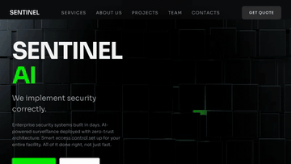

# Cool Web Code

This repository is a collection of standalone cool UI websites.

## Preview Gallery

| Site | Preview |
| --- | --- |
| [空间鱼缸](sites/space-fish-tank) |  |
| [Retro-Futurist](sites/retro-futurist) |  |
| [SENTINEL AI](sites/sentinel-ai) |  |
| [Measured](sites/measured) |  |
| [Aura](sites/aura) |  |
| [securify](sites/securify) |  |

## Structure

Each website lives in its own directory under `sites/`:

```text
sites/
  space-fish-tank/
    index.html
    package.json
    PROMPT.md
    public/assets/
    src/
  retro-futurist/
    index.html
    package.json
    PROMPT.md
    public/assets/
    src/
  sentinel-ai/
    index.html
    package.json
    PROMPT.md
    src/
  measured/
    index.html
    package.json
    PROMPT.md
    public/assets/
    public/fonts/
    src/
  aura/
    index.html
    package.json
    PROMPT.md
    public/assets/
    src/
  securify/
    index.html
    package.json
    PROMPT.md
    public/assets/
    src/
```

Each site includes a `PROMPT.md` file with the original user prompt used to generate it.
Prompt source: [motionsites.ai](https://motionsites.ai/).

## Run A Website

```sh
cd sites/space-fish-tank
pnpm install
pnpm dev
```

```sh
cd sites/retro-futurist
pnpm install
pnpm dev
```

```sh
cd sites/sentinel-ai
pnpm install
pnpm dev
```

```sh
cd sites/measured
pnpm install
pnpm dev
```

```sh
cd sites/aura
pnpm install
pnpm dev
```

```sh
cd sites/securify
pnpm install
pnpm dev
```

Future generated websites should be created as `sites/<site-name>/` instead of placing app files in the repository root.
